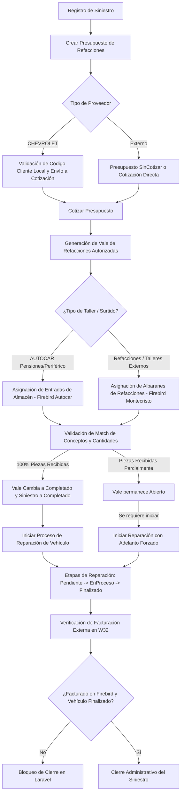

# Documentación del Flujo Técnico y de Negocio - Gestión de Siniestros

Esta documentación detalla el flujo de trabajo del negocio, las reglas técnicas, los ciclos de vida de los datos, las integraciones con sistemas externos (Firebird W32) y la arquitectura MVC de la aplicación **Gestión de Siniestros**.

---

## 1. Introducción y Contexto del Negocio

El sistema de **Gestión de Siniestros** está diseñado para controlar el ciclo operativo completo de reparación de vehículos siniestrados y el abastecimiento de sus refacciones. Abarca desde la creación del siniestro, el levantamiento de presupuestos de refacciones, la generación de vales de autorización, la recepción física de piezas (mediante entradas de almacén o albaranes de entrega) y el control de etapas de reparación del vehículo, hasta la verificación de facturación final y el cierre administrativo del siniestro.

### Pila Tecnológica
- **Backend**: Laravel (Arquitectura MVC tradicional)
- **Base de Datos Principal**: MySQL (para control interno de siniestros, vales y piezas)
- **Base de Datos Externa (W32)**: Firebird (para consulta y validación de facturación, remisiones y piezas de proveedores)
- **Frontend**: Blade (Vistas), Tailwind CSS, Flowbite y JavaScript nativo
- **Alertas y Modales**: SweetAlert2

---

## 2. Diagrama de Flujo General del Sistema

A continuación se muestra el ciclo operativo completo y la interacción de los diferentes módulos técnicos del sistema.

---

## 3. Ciclos de Vida y Transiciones de Estados

El comportamiento del sistema se rige por las transiciones de estados de cuatro entidades principales:

### A. Siniestros
Representa el siniestro registrado y el vehículo asociado.
- **`Abierto`**: Estado por defecto al crearse el siniestro en [SiniestroController.php](file:///var/www/html/gestionsiniestros/Larv/app/Http/Controllers/SiniestroController.php#L215-L274).
- **`Completado`**: Pasa a este estado automáticamente cuando el scope calcula que la diferencia de piezas autorizadas y piezas recibidas (`pzs_faltantes`) es menor o igual a cero.
- **`Cerrado`**: Estado final tras la validación administrativa de facturas y piezas.
- **`Cancelado`**: Cancelación manual. Cancela en cascada presupuestos, vales, entradas y albaranes asociados al siniestro.

> [!IMPORTANT]
> **Reglas Críticas para Cerrar un Siniestro (`cerrar()`):**
> 1. **Estado del Vehículo (Solo Autocares):** Si el taller es `AUTOCAR PENSIONES` o `AUTOCAR PERIFERICO`, el estado del vehículo en `vehiculo_info` debe ser obligatoriamente `Finalizado`.
> 2. **Facturación Externa:**
>    - Para Autocares: Se consulta la base de datos de Autocar (`W32::isFacturadoByNumOrdenAC`) usando el número de orden y el `id_w32` del perfil.
>    - Para Refacciones: Se consulta la base de Montecristo (`W32::isFacturadoByAlbaranRef`) usando el número de albarán para cada albarán activo del siniestro.
>    Si el documento no está facturado en Firebird, se bloquea el cierre.
> 3. **Piezas Cubiertas:** Se evalúa que la suma de piezas recibidas en entradas y albaranes activos para cada vale sea igual o mayor a la cantidad original autorizada en el vale. Si falta alguna pieza, se bloquea el cierre del siniestro.

---

### B. Presupuestos
Contiene la lista de piezas cotizadas o pendientes de cotizar.
- **`SinCotizar`**: Estado inicial de presupuestos de proveedores externos que requieren cotización manual o carga de imágenes de evidencias.
- **`Pendiente`**: Estado inicial si el proveedor es `CHEVROLET` (esperando respuesta de cotización formal).
- **`Cotizado`**: Cuando el presupuesto ya cuenta con subtotal, IVA y totales y las piezas tienen precios cargados.
- **`Cancelado`**: Si se cancela el siniestro o el presupuesto directamente.

> [!TIP]
> Si el usuario cuenta con el permiso `cotizarDirectamente`, el presupuesto se almacena directamente en estado `Cotizado` al crearse en [PresupuestoController.php](file:///var/www/html/gestionsiniestros/Larv/app/Http/Controllers/PresupuestoController.php#L176-L284).

---

### C. Vales
Autorizaciones de compra y surtido de refacciones vinculadas a un presupuesto.
- **`Abierto`**: El vale ha sido creado y está en proceso de abastecimiento de piezas.
- **`Completado`**: Todas las refacciones vinculadas al vale han sido recibidas (Albaranes/Entradas).
  - *Regla Especial:* Para talleres de Autocar, solo las **entradas** cuentan para completar un vale (los albaranes no cierran vales en Autocar).
- **`Cerrado`**: El vale se cierra automáticamente cuando el siniestro asociado pasa a estado `Cerrado`.
- **`Cancelado`**: Cancelación manual en [ValeController.php](file:///var/www/html/gestionsiniestros/Larv/app/Http/Controllers/ValeController.php#L343-L431).
  - *Restricción:* No se puede cancelar un vale si ya tiene entradas o albaranes asociados.

---

### D. Proceso del Vehículo
Controla el estado del trabajo físico de reparación de la unidad en el taller.
- **`Pendiente`**: Estado inicial de reparación física al crear el siniestro.
- **`EnProceso`**: El vehículo entra a reparación activa en el taller.
  - *Regla de Inicio:* Para pasar a este estado, todos los siniestros asociados al vehículo deben estar en estado `Completado` (todas las piezas recibidas). Si faltan piezas, el sistema avisa al usuario y le permite forzar un "adelanto" (`adelanto = 1`) para iniciar el trabajo físico de inmediato.
- **`Pausado`**: El proceso se detiene temporalmente. Requiere capturar obligatoriamente un `motivo_pausa` en [ProcesoVehiculoController.php](file:///var/www/html/gestionsiniestros/Larv/app/Http/Controllers/ProcesoVehiculoController.php#L45-L84).
- **`Finalizado`**: Trabajo terminado con registro de `fecha_fin = now()`.

---

## 4. Mapeo de Controladores y Modelos

El sistema sigue la estructura clásica de Laravel MVC organizada en la carpeta [Larv/](file:///var/www/html/gestionsiniestros/Larv):

### Controladores Clave
- **[SiniestroController.php](file:///var/www/html/gestionsiniestros/Larv/app/Http/Controllers/SiniestroController.php)**: Registro de siniestros, cancelación total en cascada, reabrir siniestro y validaciones avanzadas para la función de cierre administrativo.
- **[PresupuestoController.php](file:///var/www/html/gestionsiniestros/Larv/app/Http/Controllers/PresupuestoController.php)**: Gestión de presupuestos, creación por lotes de piezas, flujo de cotización, carga de evidencias, exportación a Excel y notificaciones de cotización por correo electrónico.
- **[ValeController.php](file:///var/www/html/gestionsiniestros/Larv/app/Http/Controllers/ValeController.php)**: Creación de vales con desglose de refacciones, validación de coincidencia ("match") contra documentos de albaranes/entradas, complementos de vales y flujos de eliminación controlada de partes.
- **[EntradaController.php](file:///var/www/html/gestionsiniestros/Larv/app/Http/Controllers/EntradaController.php)**: Gestión de recepción de refacciones para talleres Autocar a través de la integración con base de datos Firebird (remisiones tipo 91 y 92).
- **[AlbaranController.php](file:///var/www/html/gestionsiniestros/Larv/app/Http/Controllers/AlbaranController.php)**: Gestión de recepción de refacciones para talleres externos/refacciones a través de la integración con Montecristo en Firebird (albaranes tipo 11).
- **[ProcesoVehiculoController.php](file:///var/www/html/gestionsiniestros/Larv/app/Http/Controllers/ProcesoVehiculoController.php)**: Gestión de transiciones de estados del vehículo en taller (Pendiente, EnProceso, Pausado, Finalizado).

### Modelos y Relaciones Clave
- **[Siniestro.php](file:///var/www/html/gestionsiniestros/Larv/app/Models/Siniestro.php)**:
  - `vehiculoInfo()`: Relación 1:1 inversa con el vehículo.
  - `presupuestos()`: Relación 1:N con presupuestos.
  - `scopeWithPresupuestosAndVales()`: Calcula en tiempo real estadísticas agregadas de siniestros (porcentaje de piezas recibidas, piezas autorizadas, piezas recibidas y piezas faltantes según el taller y proveedor).
- **[Presupuesto.php](file:///var/www/html/gestionsiniestros/Larv/app/Models/Presupuesto.php)**:
  - `piezas()`: Relación 1:N con piezas asociadas al presupuesto.
  - `vales()`: Relación 1:N con vales generados para el presupuesto.
  - `siniestros()`: Relación 1:N inversa con siniestro.
- **[Vale.php](file:///var/www/html/gestionsiniestros/Larv/app/Models/Vale.php)**:
  - `presupuestos()`: Relación 1:N inversa con presupuesto.
  - `albaranes()`, `entradas()`: Relaciones 1:N con los documentos de recepción física.
  - `piezas()`: Relación N:M (BelongsToMany) con piezas usando la tabla pivote `piezas_vales` que maneja atributos de auditoría de eliminación de refacciones.
- **[Entrada.php](file:///var/www/html/gestionsiniestros/Larv/app/Models/Entrada.php)** / **[Albaran.php](file:///var/www/html/gestionsiniestros/Larv/app/Models/Albaran.php)**: Modelos que representan documentos físicos de almacén e interactúan con la base de datos externa W32.

---

## 5. Reglas de Negocio Especiales

### A. Lógica por Tipo de Taller: Autocares vs Refacciones
El sistema se comporta de forma distinta dependiendo de si el vehículo está en un taller propio de Autocar o en un taller externo:

1. **Talleres Autocar (Pensiones o Periférico):**
   - El abastecimiento definitivo de piezas se realiza mediante **Entradas de Almacén** mapeadas directamente de la base de datos Firebird Autocar (`MMW32_AUT`).
   - El vale y el siniestro solo pueden marcarse como `Completado` basándose en las cantidades recibidas en estas entradas.
   - El siniestro no se puede cerrar a menos que el vehículo esté físicamente en estado `Finalizado`.

2. **Refacciones / Talleres Externos:**
   - El abastecimiento de piezas se realiza mediante **Albaranes** mapeados directamente de la base de datos de refacciones Montecristo (`MMW32`).
   - El vale y el siniestro se marcan como `Completado` basándose en las cantidades de los albaranes.
   - No hay bloqueo por estado del vehículo para realizar el cierre administrativo.

---

### B. Lógica de Proveedor: CHEVROLET vs Proveedores Externos
- **Proveedor CHEVROLET:**
  - Al realizar la cotización de un presupuesto en [PresupuestoController.php](file:///var/www/html/gestionsiniestros/Larv/app/Http/Controllers/PresupuestoController.php#L408-L431), se exige la captura obligatoria de un **Código de Cliente**.
  - Dicho código se valida directamente en la tabla local `clientes` (debe existir y tener `activo = 1`).
  - Los vales generados con proveedor `CHEVROLET` y filtrados en el perfil de "Refacciones" son notificados por correo de forma inmediata al crearse o cancelarse.
- **Otros Proveedores:**
  - No requieren código de cliente obligatorio y su flujo de cotización suele ser directo o de asignación libre.

---

## 6. Integración con Bases de Datos Externas (W32 - Firebird)

La interacción con los sistemas ERP externos se realiza mediante conexiones PDO a bases de datos Firebird configuradas en la clase [W32.php](file:///var/www/html/gestionsiniestros/Larv/app/Models/W32.php):

### Conexiones Firebird
1. **Montecristo (`coneccionMontecristo()`)**:
   - DSN: `192.168.15.210:MMW32` (Credenciales preestablecidas `SYSDBA` / `masterkey`).
   - Propósito: Consulta de albaranes de refacciones externos (documentos con `tipdoc = 11`) y verificación de facturación de albaranes.
2. **Autocar (`coneccionAutocar()`)**:
   - DSN: `192.168.15.234:MMW32_AUT` (Credenciales `SYSDBA` / `masterkey`).
   - Propósito: Consulta de entradas de almacén para Autocares (remisiones con `tipdoc IN (91, 92)`) y verificación de órdenes facturadas (`CODIGOHT`).

### Lógicas de Consulta Clave

*   **Búsqueda de Albaranes (`consultarAlbaranW32()`):**
    Une las tablas `cabfactu` (CFAC) y `detfactu` (DFAC) filtrando por `CFAC.tipdoc = 11`. Posee lógica de marca: si es `CHEVROLET` busca en la familia `DFAC.FAMCON = 'CHEVROLET'`, en caso contrario busca `'OTROS'`. El ID de empresa de Montecristo está hardcodeado a `5815609`.
*   **Búsqueda de Entradas (`consultarEntradaW32()`):**
    Une `cabpedi` (cabecera) y `detpedi` (detalle) buscando remisiones con `cab.tipdoc IN (91, 92)` y filtrando por la UDN/Empresa del perfil del taller:
    - `AUTOCAR PENSIONES` -> ID `5815609`
    - `AUTOCAR PERIFERICO` -> ID `343962763`

---

## 7. Seguridad y Flujo de Eliminación de Refacciones en Vales

Para evitar descuadres entre lo registrado físicamente en taller y el control de inventario de refacciones, se implementó un riguroso flujo de modificación y eliminación segura de piezas en vales en [ValeController.php](file:///var/www/html/gestionsiniestros/Larv/app/Http/Controllers/ValeController.php):

### A. Bloqueo por Surtido Activo
Si un usuario intenta eliminar una pieza de un vale en `eliminarParte()`, el sistema ejecuta una transacción para evaluar si dicha pieza cuenta con **recepciones activas**:
- Cuenta registros de piezas asociadas en `piezas_albaranes` activos vinculados al vale.
- Cuenta registros de piezas asociadas en `piezas_entradas` activas vinculadas al vale.
- **Si hay surtido activo:** Se aborta la operación y se muestra un mensaje de SweetAlert indicando que la pieza no se puede eliminar hasta que se "liberen" las partes de almacén primero.

### B. Liberación de Partes
Para poder eliminar o modificar un vale que ya tiene surtido, el personal autorizado debe **liberar la parte** (`liberarParte()` en controladores de Entrada/Albarán). Esta acción marca la pieza de remisión o albarán con `activo = 0`. Una vez liberado el inventario físico en el sistema, la pieza del vale puede ser eliminada.

### C. Flujo de Solicitudes de Eliminación
Si el rol del usuario en sesión no posee los permisos directos para eliminar refacciones del vale, el sistema cuenta con un flujo de autorización remota:
1. El usuario solicita la eliminación de la pieza capturando un motivo.
2. El sistema actualiza los campos pivote `solicitud_eliminacion = true`, `id_usuario_solicita_eliminacion = Auth::id()` y `fecha_solicitud_eliminacion = now()` en la relación de `piezas_vales` de [ValeController.php](file:///var/www/html/gestionsiniestros/Larv/app/Http/Controllers/ValeController.php#L1335-L1408).
3. Se despacha un correo (`MailSolicitudEliminacion`) al usuario cotizador original del presupuesto.
4. El cotizador puede aprobar la eliminación (lo que ejecuta `eliminarParte()` en el vale) o **rechazar la solicitud** (ejecutando `rechazarSolicitudEliminacion()` en [ValeController.php](file:///var/www/html/gestionsiniestros/Larv/app/Http/Controllers/ValeController.php#L1433-L1504)), lo cual restablece `solicitud_eliminacion = false` y notifica por correo al solicitante original.
